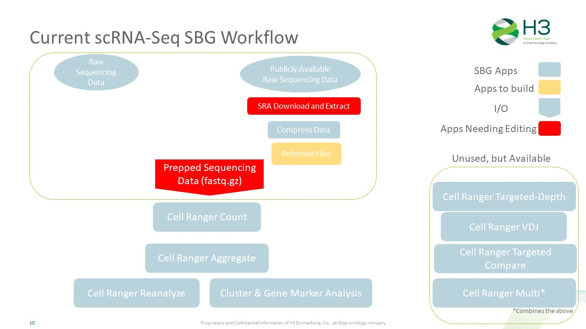
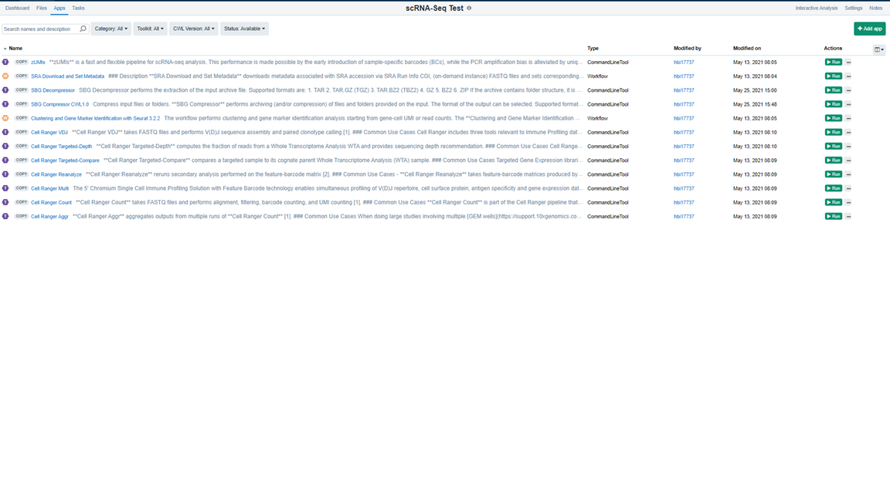

# Single Cell RNA-Seq Running on Seven Bridges Platform
By: Nathan T. Johnson  
Date: 2021.12.06

## Purpose 

Our computational infastructure vendor Seven Bridges has scRNA-Seq infastructure to allow us to run through

# Table of contents
1. [Conducting scRNA-Seq Analysis (Quickstart) on Seven Bridges](#quickstart)
2. [scRNA-Seq SBG Outline](#introduction)
2. [scRNA-Seq SBG Available Apps](#paragraph1)
    1. [Sub paragraph](#subparagraph1)
3. [Errors with scRNA-Seq SBG Apps](#paragraph2)

## Conducting scRNA-Seq Analysis (Quickstart) on Seven Bridges 

## Typical scRNA-Seq Analysis
Extensive Quality Control and pre-processing
Cluster the single cells
Identify single cell type
Explore the range of single cell states
Differential analysis between clusters, types, states
Compare the above between biological conditions

## Goal
Identify relevant tools
Data Science Team
Biologists (interactive visualization)
Download multiple datasets
Publicly available
10x Human PMBC example dataset
Dataset mixture of mouse and human
Attempt to analyze datasets throughout entire pipeline
Primarily used 
10x Cell Ranger
Visualization Tools
Bioturing (Paid, currently limited licenses)
Loupe (Free 10x Visualization Tool)

## What Deliverables Should Be

Brainstorming on H3 Fully Desired Deliverables:
QC assessment
Dimension Reduction
Normalization
Cluster Analysis
Cell Identity
Cell State
Comparisons of the above between biological states
Dashboard & Report representation
A Loupe data file for on your laptop visualization
Trajectory Analysis
Analyze publicly available scRNA-Seq data
Data output for extended analysis

## scRNA-Seq SBG Outline 

## scRNA-Seq SBG Available Apps 

### Sub paragraph 
This is a sub paragraph, formatted in heading 3 style

## Challenges with scRNA-Seq SBG Apps 
There are two type of challenges.  Those related to SBG and those related to how to run Cell Ranger.

## Overall Perspective

What criteria are necessary to use scRNA-Seq apps for H3 analysis purporse

*Can not use publicly available scRNA-Seq Data with SBG scRNA-Seq Data*

